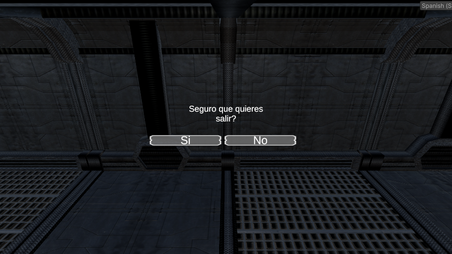
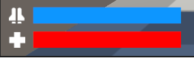

## Índice
- [1. Controles](#1-controles)
- [2. Pantallas](#2-pantallas)
    - [2.1. Pantalla de inicio](#21-pantalla-de-inicio)
    - [2.2. Menu principal](#22-menu-principal)
        - [2.2.1. Opciones](#221-opciones)
        - [2.2.2. Salida](#222-salida)
        - [2.2.3. Selector de niveles](#223-selector-de-niveles)
    - [2.3. Nivel 1](#23-nivel-1)
    - [2.4. Nivel 2](#24-nivel-2)
    - [2.5. Nivel 3](#25-nivel-3)
    - [2.6. Game Over](#26-pantalla-de-game-over)
    - [2.7. Fin del juego](#27-pantalla-de-fin-del-juego)
- [3. Diseño](#3-diseño)
    - [3.1. Armas](#31-armas)
        - [3.1.1. Cambio de arma](#311-cambio-de-arma)
        - [3.1.2. Recarga de arma](#312-recarga-de-arma)
        - [3.1.3. Modo puntería](#313-modo-puntería)
        - [3.1.4. Disparar arma](#314-disparar-arma)
        - [3.1.5. Gestor de munición](#315-gestor-de-munición)
    - [3.2. Recolectables](#32-recolectables)
        - [3.2.1. Munición](#321-munición)
        - [3.3.2. Salud](#322-salud)
        - [3.3.3. Escudo](#323-escudo)
        - [3.3.4. Llaves](#324-llaves)
    - [3.3. Puertas](#33-puertas)
        - [3.3.1. Puerta automática](#331-puerta-automática)
        - [3.3.2. Puerta cerrada con llave](#332-puerta-cerrada-con-llave)
        - [3.3.3. Puerta cerrada por palanca](#333-puerta-cerrada-por-palanca)
        - [3.3.4. Puerta cerrada por terminales](#334-puerta-cerrada-por-terminales)
    - [3.4. Plataformas](#34-plataformas)
    - [3.5. Enemigos](#35-enemigos)
        - [3.5.1. Volador](#351-volador)
        - [3.5.2. Suicida](#352-suicida)
    - [3.6. Checkpoints](#36-checkpoints)
    - [3.7. Sensibilidad del ratón](#37-sensibilidad-del-ratón)
    - [3.8. Zonas de muerte](#38-zonas-de-muerte)
    - [3.9. Sistema de salud y escudo](#39-sistema-de-salud-y-escudo)
- [4.0. Cosas no implementadas](#40-cosas-no-implementadas)

# Vídeos de explicación de funcionalidades

# Vídeo de presentación

# 1. Controles

<b>Movimiento del personaje</b>: Teclas `W,A,S,D` o las flechas de dirección.
<b>Salto</b>: Tecla `Barra espaciadora`.
<b>Disparo</b>: Botón izquierdo del ratón.
<b>Apuntar</b>: Botón derecho del ratón.
<b>Correr</b>: Tecla `Shift`.
<b>Cambiar de arma</b>: Teclas numéricas o moviendo la rueda del ratón.
<b>Recargar arma</b>: Tecla ´R´.
<b>Interactuar</b>: Tecla `E` al estar cerca de un objeto interactuable.
<b>Pausa</b>: Tecla de `Escape`.

# 2. Pantallas

## 2.1. Pantalla de inicio

La pantalla de inicio muestra el logo de la empresa. En mi caso como es una práctica de la UOC he decidido utilizar su logo. La escena ejecuta una corutina donde hace una transición inicial de un segundo. Después espera tres segundos para dar tiempo al jugador de ver el logo. Finalmente, se hace la animación de salida de un segundo.

## 2.2. Menu principal

En esta página se puede empezar partida ir al menu de opciones o salir del juego.

### 2.2.1 Opciones

En este menu se puede configurar diferentes opciones del juego. En mi caso el nivel de volumen de la música de fondo y de efectos de sonido asi como el idioma del juego.

### 2.2.2. Salida

Es un pequeño menu para que el jugador pueda decidir si quiere cerrar la aplicación. En el modo `Play` de Unity esta función no funciona solo estaría disponible en las builds.

### 2.2.3. Selector de niveles

En esta pantalla el jugador podrá escoger el nivel con el que quiere empezar a jugar.

## 2.3. Nivel 1

El primer nivel es el más sencillo de todos 

## 2.4. Nivel 2

En el segundo nivel ya estamos dentro de las instalaciones por lo que el escenario es completamente cerrado y de interior. Aquí el jugador deberá abrise paso entre los enemigos y diferentes puertas cerradas.

## 2.5. Nivel 3

El último nivel del juego. Aquí presento un precipicio donde el jugador puede morir al instante y algunas puertas cerradas. El número de recursos es más limitado y el número de enemigos es más alto.

## 2.6. Pantalla de Game Over

En el momento en el que el jugador pierde toda la salud se pasa a esta pantalla donde se le da la opción al jugador de contiuar o volver al menu principal. En el caso de que le de a continuar si a llegado a un checkpoint el jugador empezará desde allí.

## 2.7. Pantalla de fin del juego

He puesto una pantalla sencilla para felicitar al jugador después de completar los tres niveles. A partir de aqui solo hay un botón de continuar que le lleva al menú principal.

# 3. Diseño

## 3.1. Armas

He implementado tres armas en total>
- Pistola: Arma lenta pero precisa. Tiene un daño moderado y un cargador pequeño.
- Ametralladora: Arma muy rápida e imprecisa. Tiene un daño moderado y un cargador grande.
- Escopeta: Arma muy lenta con un disparo disperso. La recarga es muy lenta pero lo compensa con un daño muy elevado si se utiliza de cerca.

### 3.1.1. Cambio de arma

Para el cambio de arma se deben dar estas condiciones:
- El arma actual no debe estar en recarga.
- El jugador debe indicar que quiere cambiar de arma.

> if (!transform.GetChild(selectedWeapon).GetComponent<GunController>().GetIsReloading())

Todas las armas cuelgan del jugador y solo esta activa una. El cambio de armas funciona combinando los hijos del player con el gestor de munición y el controlador del cambio de objetos.
El Gestor de munición y de cambio de objetos se llena con los hijos del jugador, de manera que el elemento 0 del array de armas es el primer hijo de las armas del jugador

### 3.1.2. Recarga de arma

Para realizar la carga del arma se tienen que cumplir tres condiciones:
- El jugador debe indicar que quiere recargar el arma.
- El arma tiene munición fuera del cargador.
- El cargador no debe estar lleno.

Lo primero que tengo es una variable booleana para indicar si el esta esta siendo recargada.
En el momento que se inicie la recarga tengo una `Coroutine` que pone el valor a true y al pasar X segundos la pone en false. Por otro lado tengo que reproducir el audio de recarga.
Para saber si tengo munición se lo tengo que preguntar al gestor de munición.
Finalmente miro si el jugador a pulsado la tecla `R`.
Para cada arma he implementado una animación de carga. Cuando se produce la recarga la reproduzco. También indico al gestor de munición que estoy recargando y debe actualizar la munición que tiene en total y en el cargador. Finalmente queda reproducir el sonido de recarga.

    if (Input.GetKeyDown(KeyCode.R) && !isRealoading && ammoController.GetCurrentAmmo().currentAmmo > 0 && !ammoController.IsMagazineFull())
    {
        StartCoroutine(ReloadCooldown());
        animator.SetTrigger("triggerReload");
        audioSource.clip = reloadClip;
        audioSource.PlayOneShot(reloadClip, 0.7f);
        ammoController.ReloadAmmo();  
    }

### 3.1.3. Modo puntería

En muchos shooters esta función esta implementada y he querido hacerlo en la mía. El modo puntería permite disparar un arma sin tener en cuenta la dispersión que tiene.
Por defecto se utiliza manteniendo el botón derecho del ratón.

> if (Input.GetMouseButton(1))

Para dar el efecto de apuntado he añadido un `GameObject` vacío al arma colocado en una posición concreta.
De esta manera al entrar en modo apuntado utilizando el Lerp hago el movimiento del arma hasta la posición de apuntado.

> transform.localPosition = Vector3.Lerp(transform.localPosition, shootPresitionPosition, aimSpeed * Time.deltaTime);

### 3.1.4. Disparar arma

Para poder disparar el arma se tienen que cumplir varias condiciones:
 - El arma debe tener municion en el cargador.
 - El arma no debe estar recargandose.
 - El tiempo entre el disparo anterior y este debe ser superior o igual a la cadencia de disparo del arma.
 - El jugador debe pulsar el botón de disparo.

 Para los dos primeros puntos tengo implementado un gestor de munición, al que iré preguntado por estos valores.

> if (ammoController.RemainingAmmo() && !isRealoading)

Una vez que se puede disparar el arma se deben realizar diferentes acciones. En primer lugar tengo que contar el tiempo entre este disparo y el siguiente (la cadencia). Para hacer esto tengo un valor booleano que seteo en una `Coroutine`.

    protected IEnumerator GunCooldown()
    {
        gunOnCooldown = true;
        yield return new WaitForSeconds(cadence);
        gunOnCooldown = false;
    }

Seguidamente toca indicar al gestor de munición que debe decrementar la munición del arma.
El siguiente paso es hacer el disparo en si mediante un Raycast. Aquí tengo en cuenta si el jugador esta utilizando el modo puntería o no para calcular la dispersión.

>    if (!isAiming)

Finalmente solo queda disparar el rayo y ver contra que colisiona.

    if (Physics.Raycast(Camera.main.transform.position, shootDirection, out RaycastHit hit))
    {
        // Check if is a wall or an enemy
        if (hit.collider.gameObject.CompareTag("Wall"))
        {
            // Init decal
            Instantiate(decal, hit.point, Quaternion.LookRotation(hit.normal));
        }
        else if (hit.collider.gameObject.CompareTag("Enemy"))
        {
            // Damage enemy
            hit.collider.gameObject.GetComponent<EnemyAI>().Hit(damage);
            audioSource.PlayOneShot(hitSound, 4f);
        }
        else if (hit.collider.gameObject.CompareTag("Terminal"))
        {
            // Destroy terminal
            hit.collider.gameObject.GetComponent<TerminalController>().Shooted();
        }
    }

En este punto si disparo a una pared instancio en el punto de colisión un prefab del decal.

Seguidamente queda reproducir el sonido de disparo, y en mi caso instanciar un efecto de fuego y un efecto de casquillo de bala. Así como un pequeño retroceso para el arma.

    public virtual void Shoot()
    {
        if (ammoController.RemainingAmmo() && !isRealoading)
        {
            // Delay between shoots
            StartCoroutine(GunCooldown());
            // Reduce ammo            
            ammoController.DecreaseAmmo();
            // Raycast
            PerformRaycast();
            // Add recoil
            AddRecoil();
            // Fire effect
            Instantiate(fire, shootPosition);
            // Create Casing
            CreateCasing();
        }
    }
> Flujo de disparo

Este método del arma y algunos atributos los he puesto como protected. El método como virtual.
Esto lo hago porque la escopeta tiene un disparo diferente y el método `PerformRaycast()` no se tiene que comportar igual.

    protected override void PerformRaycast()
    {                
        for(int i = 0; i < numOfPellets; i++)
        {
            Vector3 shootDirection = Camera.main.transform.forward;
            shootDirection.x += Random.Range(-spread, spread);
            shootDirection.y += Random.Range(-spread, spread);

            if (Physics.Raycast(Camera.main.transform.position, shootDirection, out RaycastHit hit))
            {
                // Check if is a wall or an enemy
                if (hit.collider.gameObject.CompareTag("Wall"))
                {
                    // Init decal
                    Instantiate(decal, hit.point, Quaternion.LookRotation(hit.normal));
                }
                else if (hit.collider.gameObject.CompareTag("Enemy"))
                {
                    // Damage enemy
                    hit.collider.gameObject.GetComponent<EnemyAI>().Hit(damage);
                    audioSource.PlayOneShot(hitSound, 4f);
                }
                else if (hit.collider.gameObject.CompareTag("Terminal"))
                {
                    hit.collider.gameObject.GetComponent<TerminalController>().Shooted();
                }
            }
        }        
    }

### 3.1.5. Gestor de munición

Como cada arma es un `GameObject` y solo tenemos activa la que estamos usando en este momento la munición no puedo hacer que se controle dentro del `GameObject` del arma. Esto se debe a que hay diferentes tipos de objetos recolectables y quiero que se recojan de forma automática sin importar el arma que se este utilizando. De esta manera puedo coger munición de escopeta mientras utilizo la pistola.
Para hacer esta funcionalidad tengo el `AmmoController` un script que esta ligado al `GameObject` del jugador. Dentro tengo un array de municiones y un índice que me indica el arma actual.

    public Ammo(int magazine, int totalMagazine, int totalAmmo, int maxAmmo)
    {
        currentMagazine = magazine;
        maxMagazine = totalMagazine;
        currentAmmo = totalAmmo;
        this.maxAmmo = maxAmmo;
    }
> Información de la munición de cada arma.

Con esto cada vez que cambio de arma lo único que tengo que hacer es cambiar el índice del array para actualizar los valores de pantalla y del controlador de arma.
Por otro lado para el tema de los recolectables tengo un método en el que se tiene que pasar el índice (arma a la que queremos dar munición) y la cantidad.

    public void IncreaseAmmo(int gun, int amount)
    {
        ammo[gun].currentAmmo += amount;
        if (ammo[gun].currentAmmo > ammo[gun].maxAmmo) ammo[gun].currentAmmo = ammo[gun].maxAmmo;        
    }

A parte de esto el gestor de munción tiene varios métodos para devolver la munición total y en el cargador que tiene el arma.

## 3.2. Recolectables

Para dividir los objetos recolectables he definido un enum.

> public enum PickUpType { health, shield, ammo, key };

Todos los objetos recolectables tienen una tributo "amount" para especificar la cantidad de recurso que aportan. Puede que este valor no tenga mucho sentido para las llaves pero de esta forma puedo ahorrar código y tener una sola implementación para todo.

### 3.2.1. Munición

La munición la he divido en tres subtipos, uno para cada arma (con un enum también).

> Munición de la pistola.

> Munición de la ametralladora.

> Munición de la escopeta

Cada tipo de munición solo aporta munición para el arma que es. No hace falta tener el arma equipada para poder recoger munición de esa arma. De esto se encarga el gestor de munición. Si se da el caso de que el jugador tiene el máximo de munición de esa arma, el objeto no se recogerá.
Internamente el `GameObject` tiene un collider que mira cuando el jugador entra dentro. Si es del tipo munición le preguntará al `AmmoController` si tiene el tope de munición de esa arma concreta y le incrementará en la cantidad especificada.

    case PickUpType.ammo:
        AmmoController ammoController = other.gameObject.GetComponent<AmmoController>();
        if (!ammoController.FullAmmo((int)guns))
        {
            ammoController.IncreaseAmmo((int)guns, amount);
            // Play Sound
            audioSource.clip = ammoSound;
            audioSource.Play();
            Destroy(gameObject, audioSource.clip.length);
        }
        break;

Si se da el caso de que el jugador no tiene el máximo de munición pero con la que va a recoger excede ese máximo el valor de munición nunca va a superar este.

### 3.2.2. Salud

> Botiquin

Para el tema de la salud es más sencillo. En este caso se pregunta al `PlayerController` si tiene la salud al máximo. Como en el caso anterior si no tiene la salud al máximo pero con el botiquin excede este valor se le pondrá por defecto el valor máximo de salud.

    case PickUpType.health:
        PlayerControler playerControler = other.gameObject.GetComponent<PlayerControler>();
        if (!playerControler.FullOfHealth())
        {
            playerControler.IncreaseHealth(amount);
            // Play Sound
            audioSource.clip = healthSound;
            audioSource.Play();
            Destroy(gameObject, audioSource.clip.length);
        }
        break;

### 3.2.3. Escudo

El funcionamiento es el mismo que para la salud.

> Escudo

    case PickUpType.shield:
        PlayerControler player = other.gameObject.GetComponent<PlayerControler>();
        if (!player.FullOfShield())
        {
            player.IncreaseShield(amount);
            // Play Sound
            audioSource.clip = shieldSound;
            audioSource.Play();
            Destroy(gameObject, audioSource.clip.length);
        }
        break;

### 3.2.4. Llaves

En el caso de la llave esta siempre va a ser recogida. En el momento de su recolección se avisa al gestor de llaves para indicar que tiene esa llave. De esa manera al acercarse a la puerta esta se abrirá.

> Llaves

    case PickUpType.key:
        KeyController keyController = other.gameObject.GetComponent<KeyController>();
        keyController.PickKey();
        audioSource.clip = keySound;
        audioSource.Play();
        Destroy(gameObject, audioSource.clip.length);
        break;

## 3.3. Puertas

He decidido implementar diferentes tipos de puertas para forzar varios tipos de mecánicas para no aburrir tanto al jugador.

### 3.3.1 Puerta automática

Esta puerta es la que se comenta en los ejemplos de la práctica he copiado la funcionalidad. Simplemente pongo que se abra la puerta cuando el jugador entre y este dentro del collider de la puerta y que se cierre cuando este salga del collider. Además he añadido un sonido para cuando la puerta se abra o se cierre.

### 3.3.2. Puerta cerrada con llave

A partir de aquí el resto de puertas heredan de la puerta automática y sobreescriben el comportamiento de apertura de la puerta.
En este caso sobreescribo los métodos del trigger del collider de la puerda. Para que se pueda abrir la puerta el jugador debe recoger la llave ligada a esa puerta. En mi caso una puerta solo puede tener ligada una llave. Cuando tenga la llave el método de entrada al collider esta sobreescrito para mirar que el jugador tenga la llave. Si tiene la llave la puerta se abre y se queda abierta siempre. Si por el caso contrario el jugador no tiene la llave se reproduce un sonido de puerta cerrada.

    protected override void OnTriggerEnter(Collider other)
    {
        if (other.gameObject.CompareTag("Player"))
        {
            KeyController keyController = other.gameObject.GetComponent<KeyController>();
            if (keyController.IsKeyPicked())
            {
                base.OnTriggerEnter(other);
            }
            else
            {
                audioSource.clip = closedDoor;
                audioSource.Play();
            }
        }
    }

### 3.3.3. Puerta cerrada por palanca

Esta puerta siempre esta cerrada. Los métodos del collider están sobreescritos para que al acercarse el jugador la puerta no se abra y reproduzca el sonido de puerta cerrada. La puerta solo se abre cuando se acciona la palanca que tiene asociada. Cada puerta solo puede tener una palanca asociada. El jugador puede acercarse a la palanca y interactuar con ella con la tecla 'E'. Esto lo he implementado poniendo un collider puesto como trigger en la palanca. Cuando el jugador este dentro se marcara como que es interactuable. Entonces el jugador podrá pulsar la tecla 'E' e interactuar con la palanca. Para dar feedback al jugador se movera la palanca y se emitirá un sonido.
La palanca solo mantiene la puerta abierta unos segundos determinados mediante una Coroutine. Con esto puedo establecer puntos de no retorno.

    private void InteractWithDoor()
    {
        if (interactable && Input.GetKeyDown(KeyCode.E) && !isOpened)
        {
            door.GetComponent<ClosedDoorByLever>().PullLever();
            StartCoroutine(OpeningTime());
            isOpened = true;
            audioSource.Play();
        }
    }

>Palanca

### 3.3.4. Puerta cerrada por terminales

Esta puerta siempre estará cerrada hasta que el jugador destruya todas las terminales que tenga asociada a ella. En este caso una puerta puede tener asociada N terminales. El jugador puede disparar a la terminal para destruirla. Para dar feedback al jugador se producirá una explosión y se quitará la luz del terminal. Cada vez que se destruye una terminal se descuenta del contador de terminales de la puerta y cuando ya no queden se quedará siempre abierta.

    public void Shooted()
    {
        light.enabled = false;
        // Play sound
        audioSource.Play();
        // Play Effect
        door.GetComponent<ClosedDoorByTerminal>().DestroyTerminal();
        var pref = Instantiate(explotionPrefab, explotionTransform);
        GetComponent<BoxCollider>().enabled = false;
        Destroy(pref, 3);
    }

> Terminal

## 3.4. Plataformas

Para implementar las plataformas tengo un GameObject que actua como plataforma y dos puntos para indicar a donde debe desplazarse. Los puntos los tengo en un array de Transform. La plataforma siempre se mueve hacia el punto de destino que tenga marcado. En mi caso un Lerp para que cuando este cerca de llegar al destino vaya más despacio. Además mediante la distancia entre la posición de destino y la posición de la plataforma puedo definir indirectamente el tiempo que una plataforma "Se para". Cuando llega al punto pasamos al siguiente y así indefinidamente.

    void CheckPosition()
    {
        if (Vector3.Distance(transform.position, points[currentPosition].position) < 0.01f)
        {
            currentPosition = (currentPosition + 1) % points.Length;
        }
    }

    void MovePlatform()
    {
        transform.position = Vector3.Lerp(transform.position, points[currentPosition].position, Time.deltaTime * speed);                        
    }

También tengo una plataforma que solo se activa cuando el jugador entra dentro de un collider. Esto es para simular un ascensor.

## 3.5. Enemigos

He implementado dos tipos de enemigos.

### 3.5.1. Volador

Enemigo volador que patrulla por una zona determinada por X puntos. Cuando el jugador entra en su radio de acción el enemigo dará una vuelta completa a una determinada velocidad buscando al jugador. Durante este estado irá lanzando diversos Raycasts para ver si uno de ellos choca con el jugador. Si no encuentra al jugador pasa a patrullar. Si por el contrario encuentra al jugador pasa a atacarle cada cierto tiempo. Este estado continua hasta que el jugador lo mata o sale del rango.
Para dar feedback al jugador cada vez que este le disparé y acierte sonará un pequeño sonido de `Hit mark`.
Cuando el enemigo pierda toda la vida explotará instanciando el efecto de una explosión y un recolectable para el jugador a modo de premio. En el momento que explota he querido implementar una pequeña animación de desaparición del enemigo. Concretamente una en la que el tamaño va disminuyendo con el paso del tiempo.

> Enmigo volador

> Máquina de estados del enemigo volador

### 3.5.2. Suicida

El segundo enemigo tiene un comportamiento similar al primero. La diferencia es la forma que tiene este de atacar. Si el primero atacaba al jugador este le persigue hasta estar lo suficientemente cerca y explota causando mucho daño. Por lo tanto tenemos que este enemigo en cuanto detecta al jugador pasa al estado de persecución hasta que el jugador lo mata o se suicida.
Si se da el caso de que el enemigo muere porque se ha suicidado no se instanciara ningún recolectable para el jugador.

>Enemigo suicida

> Máquina de estados del enemigo suicida

## 3.6. Checkpoints

En algunos niveles utilizo los checkpoints. He implementado uno muy sencillo en el que guardo datos importantes:
- Posición inicial del jugador.
- Información del gestor de munición.
- Nivel del checkpoint.

Para implementar esto tengo una clase Serializable con esta información. Cuando el jugador llega al checkpoint se le avisa con un mensaje y se crea una instancia de esta clase.
Seguidamente tengo un `File Manager` que me guarda los datos de esta clase. Este es estático y serializa en un fichero los datos.

## 3.8. Zonas de muerte

He implementado zonas de muerte. En estas zonas cuando se detecta la presencia del jugador este muere inmediatamente. En mi caso esto lo he implementado para simular caídas al vacio.
Solo tengo que tener un GameObject que tenga un collider con trigger y un script que mira cuando el jugador entra dentro del collider. En ese momento le quita todos los puntos de vida y el GameManager dará la partida por finalizada.

## 3.9. Sistema de salud y escudo

Finalmente queda hablar de como quantifico la salud y el escudo del jugador. En el `CharacterController` tengo 4 valores para controlar esto. Dos para guardar el valor de salud y escudo que tiene el jugador y otros dos para señalar el tope de estos.
Cada vez que se realiza una modificación sobre estos valores se actualiza la interfaz gráfica.
Para la interfaz gráfica tengo dos imágenes superpuestas entre sí para marcar el nivel de llenado de la barra. La primera hace de "Barra" y la pongo de tipo `Filled` de esta manera puedo hacer una conversión de 0 a 1 para llenar y representar la barra.

>Barra de salud y escudo

## 4.0. Cosas no implementadas

No he utilizado la pipeline de alta resolución.